# Essentials of Mathematical Methods
## About
This repo contains my online evolving book **Essentials of Mathematical Methods: Foundations, Principles, and Algorithms**. This book surveys fundamental results in major branches of applied mathematics, with emphasized applications in **stochastic system modeling, statistical learning, and optimal decision-making**. \
The book takes an approach that resembles many math and CS theory textbooks. Each section starts with basic concepts, motivations and definitions, then important properties in Lemma, Theorem, and Corollary (with proof), and then computational procedures summarized in Methods and Algorithms. I believe this approach can help distinguish different concepts and state important results in a clean and organized manner. \
I am hoping this book can be beneficial to you, either you are preparing for interviews or you are doing machine learning applications and research.

[中文简介](https://github.com/yangyutu/EssentialMath/blob/master/introductionChinese.md)

This book is **free**. You can support me by purchasing it from [LeanPub](https://leanpub.com/essentialmathematicalmethods).
If you have any questions or suggestions, you can create a pull request or send me an email at yangyutu123@gmail.com

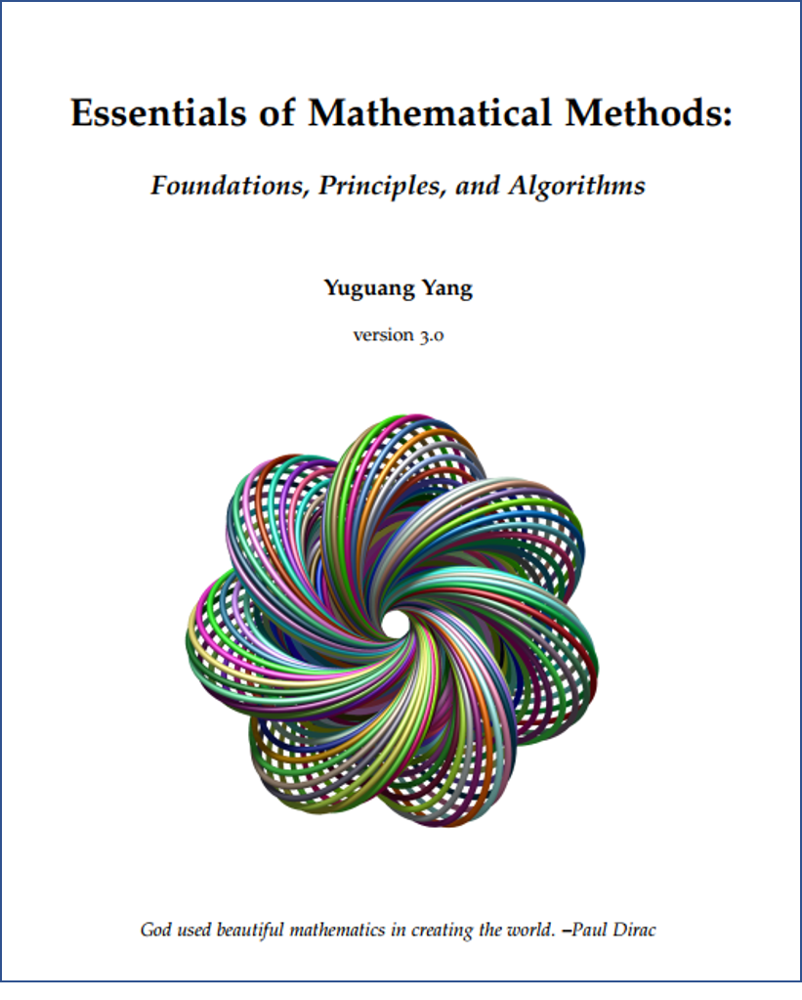

## Middle/Long term plan
The long term goal is to build a comprehensive, interactive electronic book that is handy to students, teachers, researchers, and practitioners who are passionate about mathematical modeling, artificial intelligence and machine learning. 

Currently I am working on several **mid-term** items:
* Add more diagrams, figures, and examples to demonstrate the intuition and application.
* Organize implementations for core algorithms.
* Create a new Part "Deep Learning Methods" (now it is a lengthy chapter under the Part Statistical Learning Methods), devoted to deep learning fundamentals and its applications in computer vision, time series, recommender, and NLP. 

**Long term** detailed action items:
* Create an interactive electronic book that can host dynamic visuals and short video tuturials for key parts.

## Downloads 
### Whole book
[Front Matter](https://github.com/yangyutu/EssentialMath/blob/master/PDFRelease/frontMatter.pdf) \
[All-in-One](https://github.com/yangyutu/EssentialMath/blob/master/PDFRelease/Mathmain%20JUNE.pdf)

### Selective topics
[Linear Algebra and Matrix Analysis](https://github.com/yangyutu/EssentialMath/blob/master/PDFRelease/linearAlgebra.pdf) \
[Mathematical Optimization](https://github.com/yangyutu/EssentialMath/blob/master/PDFRelease/optimization.pdf) \
[Probability and Statistical Estimation](https://github.com/yangyutu/EssentialMath/blob/master/PDFRelease/probStatistical.pdf) \
[Stochastic Process](https://github.com/yangyutu/EssentialMath/blob/master/PDFRelease/stochasticProcess.pdf) \
[Markov Chain and Random Walk](https://github.com/yangyutu/EssentialMath/blob/master/PDFRelease/MarkovChain.pdf) \
[Linear Regression Analysis](https://github.com/yangyutu/EssentialMath/blob/master/PDFRelease/linearRegression.pdf) \
[Statistical Learning](https://github.com/yangyutu/EssentialMath/blob/master/PDFRelease/statisticalLearning.pdf) \
[Neural Network and Deep Learning](https://github.com/yangyutu/EssentialMath/blob/master/PDFRelease/deepLearning.pdf) \
[(Deep) Reinforcement Learning](https://github.com/yangyutu/EssentialMath/blob/master/PDFRelease/reinforcementLearning.pdf) 

## Table of Contents
### I Mathematical Foundations
* [Sets, Sequences and Series](https://github.com/yangyutu/EssentialMath/blob/master/PDFRelease/splits/63_bookMathmain.pdf)
* [Metric Space](https://github.com/yangyutu/EssentialMath/blob/master/PDFRelease/splits/97_bookMathmain.pdf)
* [Advanced Calculus](https://github.com/yangyutu/EssentialMath/blob/master/PDFRelease/splits/119_bookMathmain.pdf)
* [Linear Algebra and Matrix Analysis](https://github.com/yangyutu/EssentialMath/blob/master/PDFRelease/splits/199_bookMathmain.pdf) 
* [Basic Functional Analysis](https://github.com/yangyutu/EssentialMath/blob/master/PDFRelease/splits/328_bookMathmain.pdf)

### II Mathematical Optimization Methods
 
* [Unconstrained Nonlinear Optimization](https://github.com/yangyutu/EssentialMath/blob/master/PDFRelease/splits/375_bookMathmain.pdf)
* [Constrained Nonlinear Optimization](https://github.com/yangyutu/EssentialMath/blob/master/PDFRelease/splits/418_bookMathmain.pdf)
* [Linear Optimization](https://github.com/yangyutu/EssentialMath/blob/master/PDFRelease/splits/464_bookMathmain.pdf)
* [Convex Analysis and Convex Optimization](https://github.com/yangyutu/EssentialMath/blob/master/PDFRelease/splits/487_bookMathmain.pdf)
* [Basic Game Theory](https://github.com/yangyutu/EssentialMath/blob/master/PDFRelease/splits/535_bookMathmain.pdf)

### III Classical Statistical Methods
* [Probability Theory](https://github.com/yangyutu/EssentialMath/blob/master/PDFRelease/splits/557_bookMathmain.pdf) 
* [Statistical Distributions](https://github.com/yangyutu/EssentialMath/blob/master/PDFRelease/splits/663_bookMathmain.pdf) 
* [Statistical Estimation Theory](https://github.com/yangyutu/EssentialMath/blob/master/PDFRelease/splits/720_bookMathmain.pdf) 
* [Multivariate Statistical Methods](https://github.com/yangyutu/EssentialMath/blob/master/PDFRelease/splits/780_bookMathmain.pdf)
* [Linear Regression Analysis](https://github.com/yangyutu/EssentialMath/blob/master/PDFRelease/splits/874_bookMathmain.pdf) 
* [Monte Carlo Methods](https://github.com/yangyutu/EssentialMath/blob/master/PDFRelease/splits/970_bookMathmain.pdf)

### IV Dynamics Modeling Methods
* [Models and estimation in linear systems](https://github.com/yangyutu/EssentialMath/blob/master/PDFRelease/splits/1008_bookMathmain.pdf) 
* [Stochastic Process](https://github.com/yangyutu/EssentialMath/blob/master/PDFRelease/splits/1085_bookMathmain.pdf)
* [Stochastic Calculus](https://github.com/yangyutu/EssentialMath/blob/master/PDFRelease/splits/1124_bookMathmain.pdf)
* [Markov Chain and Random Walk](https://github.com/yangyutu/EssentialMath/blob/master/PDFRelease/splits/1174_bookMathmain.pdf)
* [Time Series Analysis](https://github.com/yangyutu/EssentialMath/blob/master/PDFRelease/splits/1224_bookMathmain.pdf)

### V Statistical Learning Methods
* [Supervised Learning Principles and Methods](https://github.com/yangyutu/EssentialMath/blob/master/PDFRelease/splits/1306_bookMathmain.pdf) 
* [Linear Models for Regression](https://github.com/yangyutu/EssentialMath/blob/master/PDFRelease/splits/1353_bookMathmain.pdf) 
* [Linear Models for Classification](https://github.com/yangyutu/EssentialMath/blob/master/PDFRelease/splits/1373_bookMathmain.pdf) 
* [Generative Models](https://github.com/yangyutu/EssentialMath/blob/master/PDFRelease/splits/1426_bookMathmain.pdf) 
* [K Nearest Neighbors](https://github.com/yangyutu/EssentialMath/blob/master/PDFRelease/splits/1446_bookMathmain.pdf)
* [Tree Methods](https://github.com/yangyutu/EssentialMath/blob/master/PDFRelease/splits/1453_bookMathmain.pdf)
* [Ensemble and Boosting Methods](https://github.com/yangyutu/EssentialMath/blob/master/PDFRelease/splits/1478_bookMathmain.pdf) 
* [Unsupervised Statistical Learning](https://github.com/yangyutu/EssentialMath/blob/master/PDFRelease/splits/1507_bookMathmain.pdf) 
* [Neural Network and Deep Learning](https://github.com/yangyutu/EssentialMath/blob/master/PDFRelease/splits/1573_bookMathmain.pdf)

### VI Optimal Control and Reinforcement Learning Methods
* [Classical Optimal Control Theory](https://github.com/yangyutu/EssentialMath/blob/master/PDFRelease/splits/1688_bookMathmain.pdf)
* [Reinforcement Learning](https://github.com/yangyutu/EssentialMath/blob/master/PDFRelease/splits/1707_bookMathmain.pdf)

### [Appendix: Supplemental Mathematical Facts](https://github.com/yangyutu/EssentialMath/blob/master/PDFRelease/splits/1793_bookMathmain.pdf) 

## License statement

You are free to redistribute the material in any medium or format under the following terms:

    -Attribution: You must give appropriate credit, provide a link to the license, and indicate if changes were made. You may do so in any reasonable manner, but not in any way that suggests the licensor endorses you or your use.
    -NonCommercial: You may not use the material for commercial purposes.
    
*The licensor cannot revoke these freedoms as long as you follow the license terms. This licence is created via creative commons (https://creativecommons.org). If you have any questions regarding the license, please contact the author.
## Demonstration
### Linear algebra
SVD (Singular Value Decomposition) is one of the most important results in linear algebra. It is the cornerstone of many important methods in applied math, statistics, and machine learning. This books summarizes the properties of SVD with the following theorem and diagram. The proof is concise with all the supporting theorems and lemma included in the book.

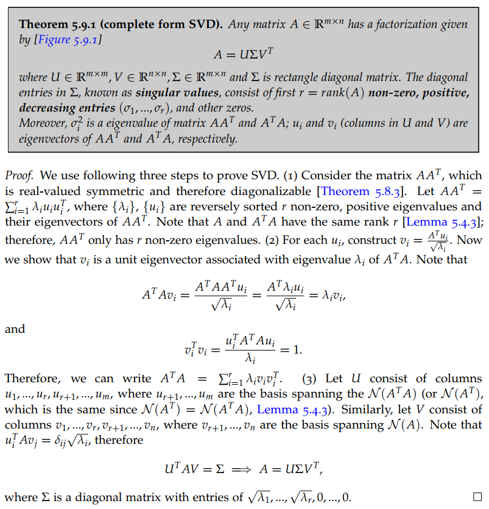 

The following diagram shows the shape of resulting matrices and captures the relationship between complete SVD and compact SVD. 

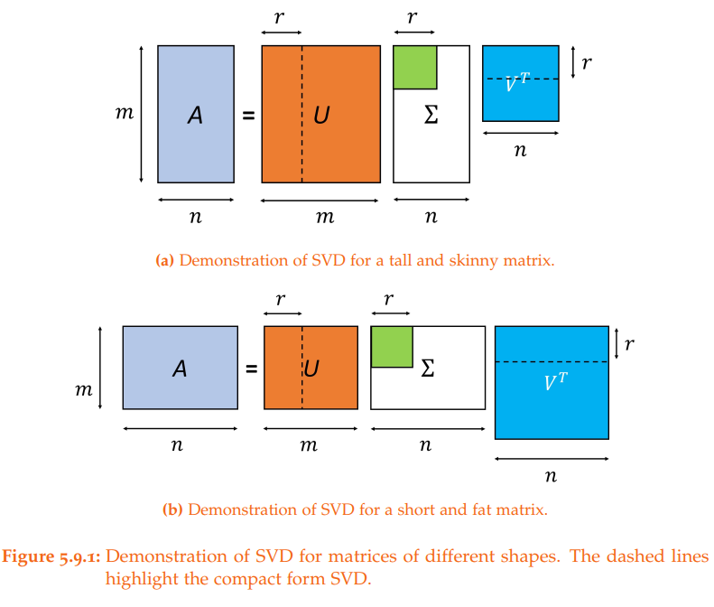 

A common mistake on the relationship between U and V is discussed as wells.

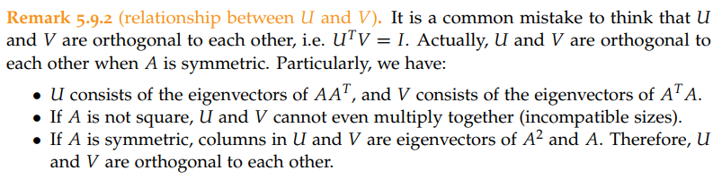 

### Applied functional analysis

Contraction mapping and its closely related fixed point theorem are essential results in applied functional analysis. We start with a diagram to  help understand contraction mapping. 

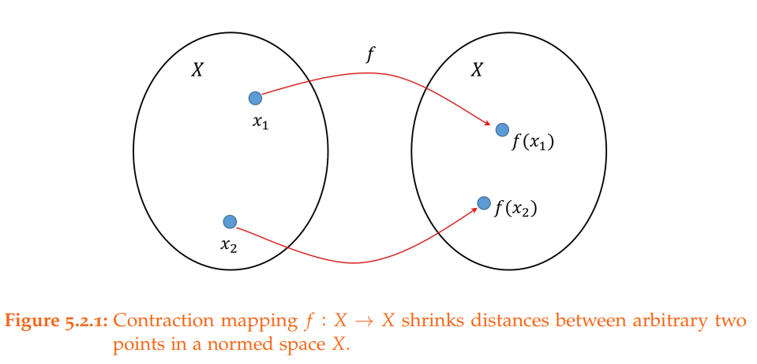 

We then state its definition and a simple example. 

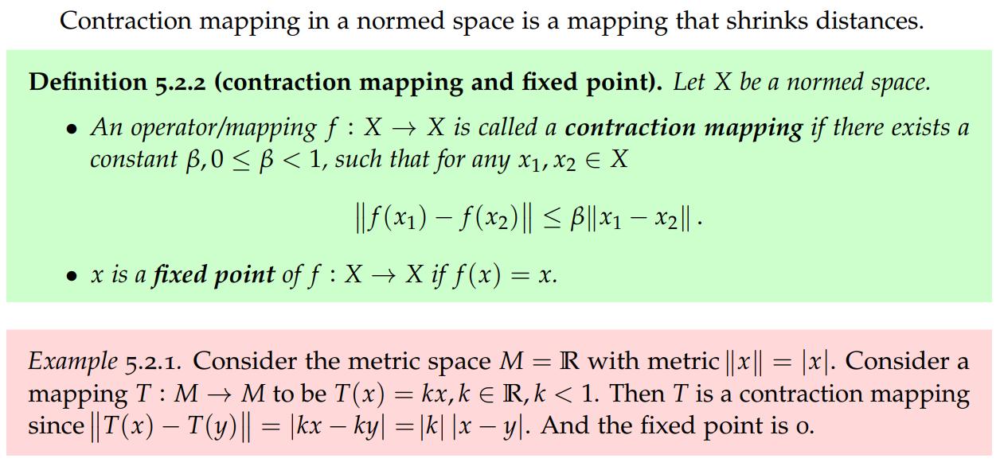 

We also discuss how to identify a contraction mapping in practice.

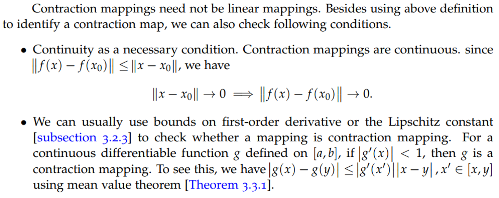 

Finally, we discuss the fixed point theorem and then prove it.

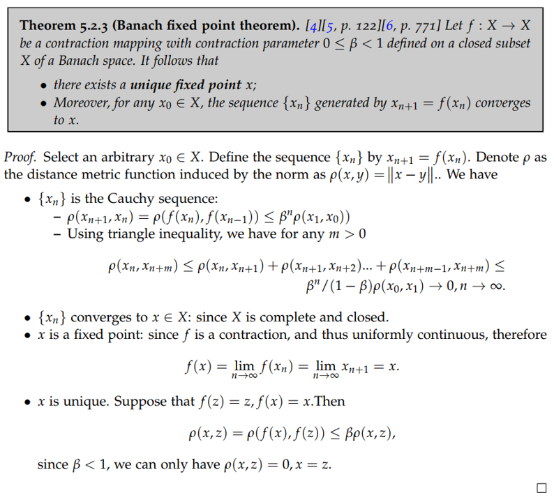 

### Statistics

In multivariate Gaussian statistics, the affine transformation theorem is used to prove a number of important properties of Gaussian random variables (such as addition, condition, etc.). This book first gives a proof of this theorem based on moment generating functions.

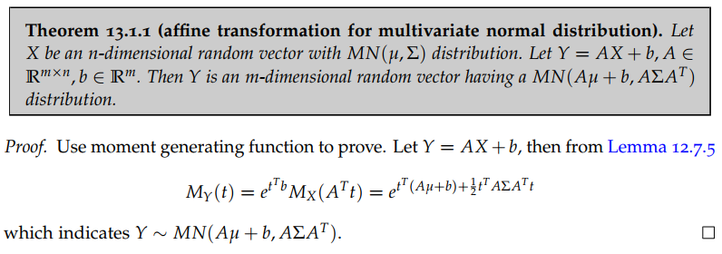 

Then the book gives the application of this theorem to the sum of multivariate Gaussian random variables. It is worth mentioning that the author emphasizes in the footnote that these result only hold when the joint normality conditions holds. 

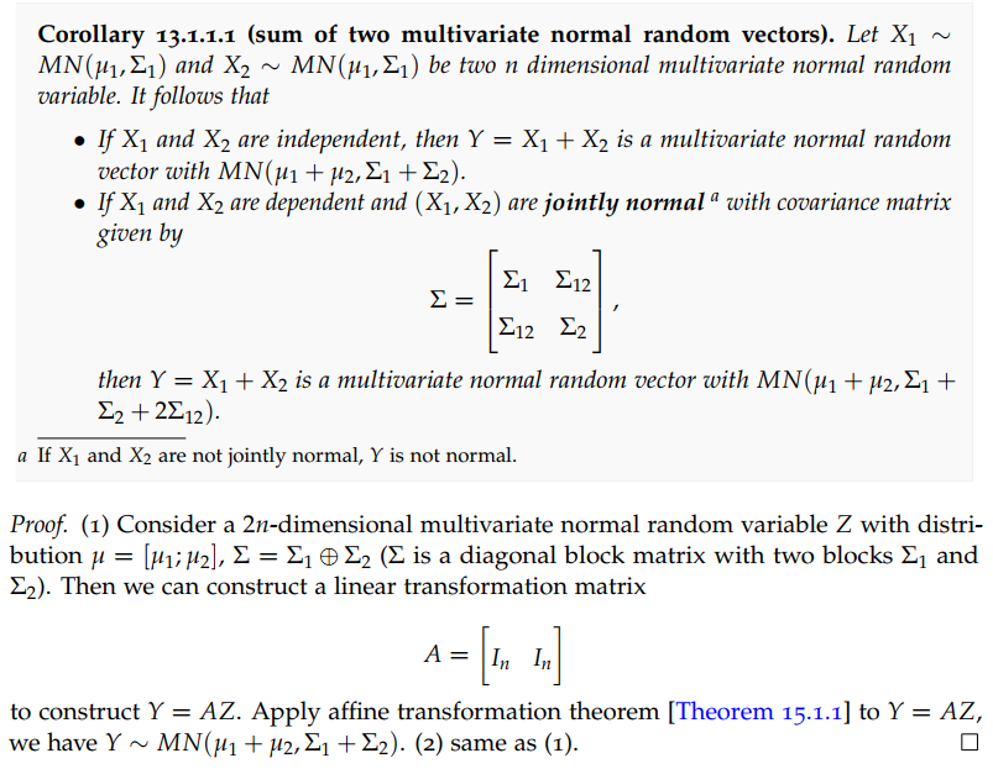 

### Machine learning
SVM, logistic regression and Perceptron learning are commonly used linear classification model in machine learning.  The three models can be unified under the same mathematical optimization framework, with each method corresponds to a different loss function. This book elaborates and shows how to transform these three models into this unified framework.

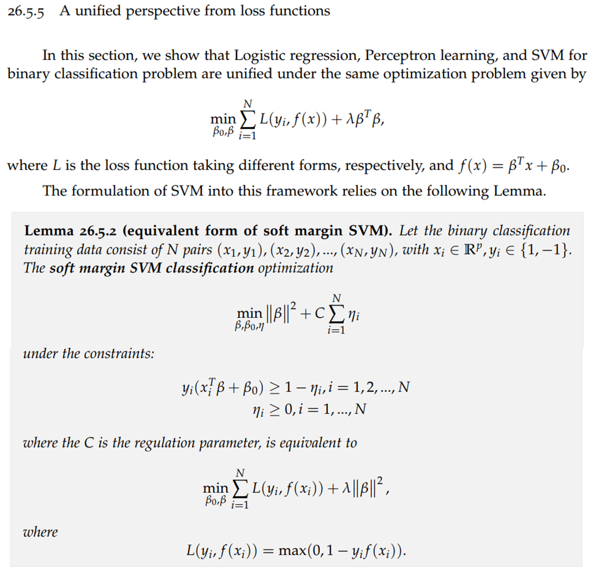 

Different loss functions for classfication are compared and summarized in the following figure. 

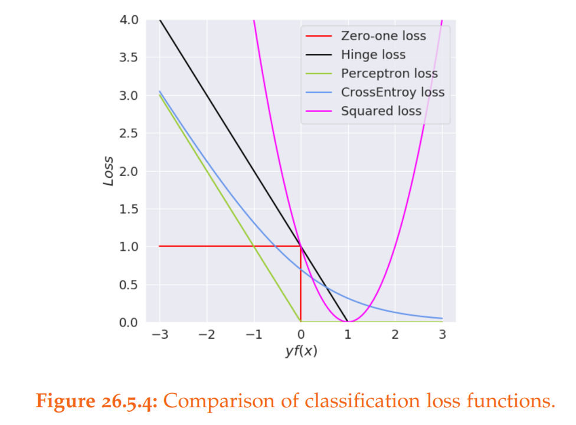 

### Reinforcement learning

Value iteration is one of the cornerstone theorems in reinforcement learning. However, many textbooks and online resources simply skip the proof. This book puts together a concise proof through contraction mapping and fixed point theorem. The contraction mapping and fixed point theorem, which are important tools in applied math, are introduced in detail in Part I of this book.

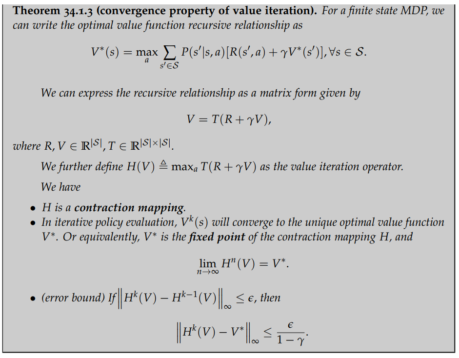 

Then the book gives an algorithm based on the value iteration theorem.

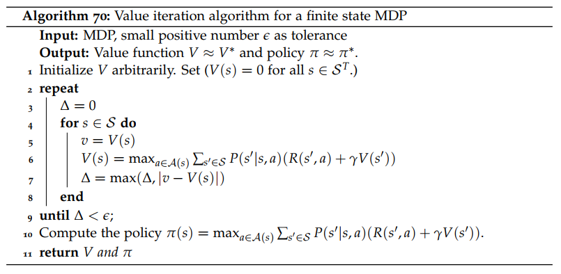 

