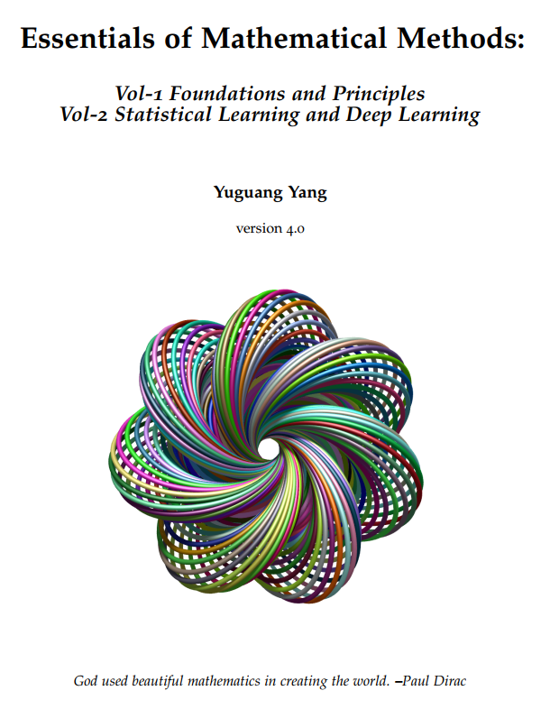
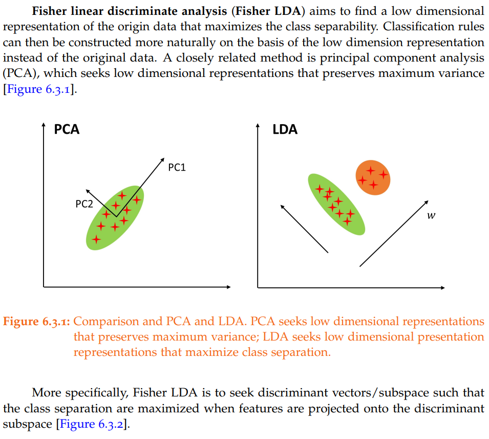
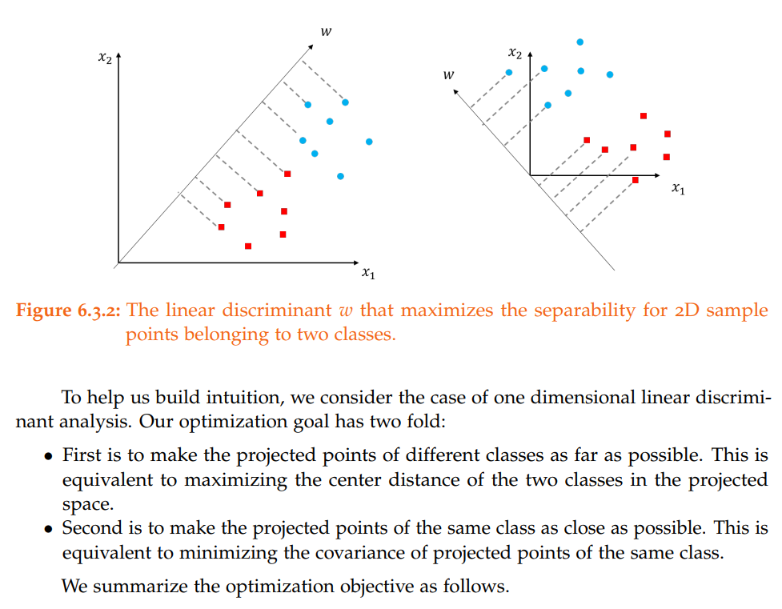
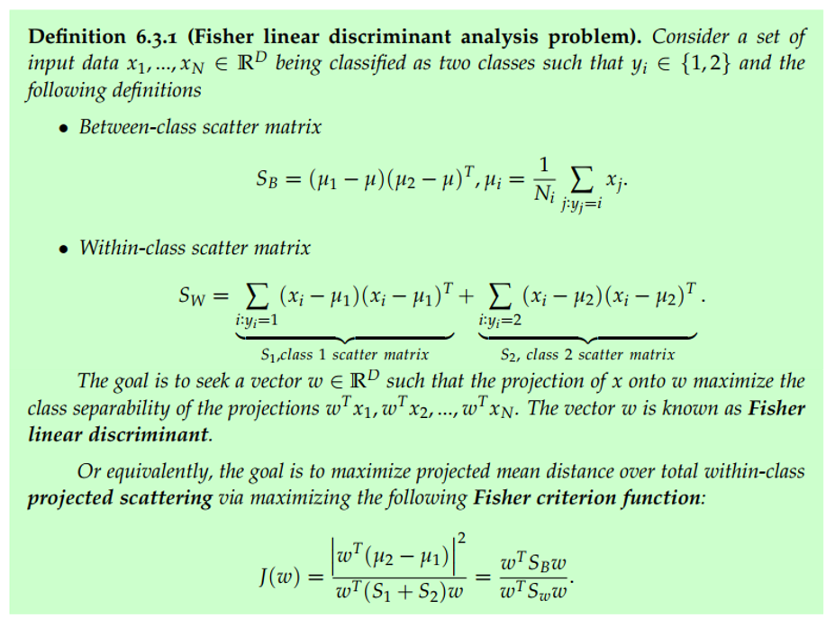
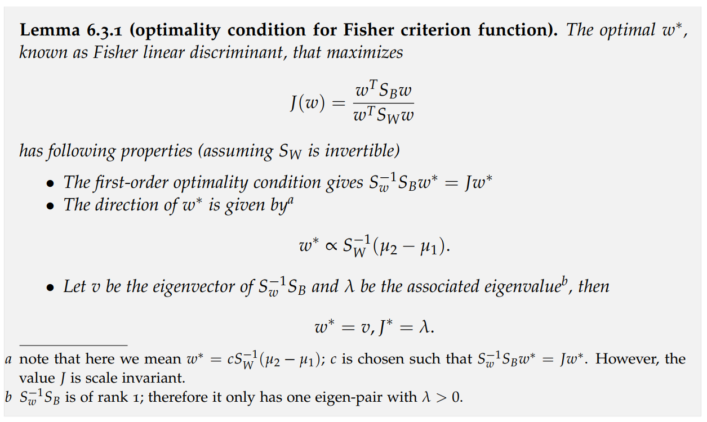
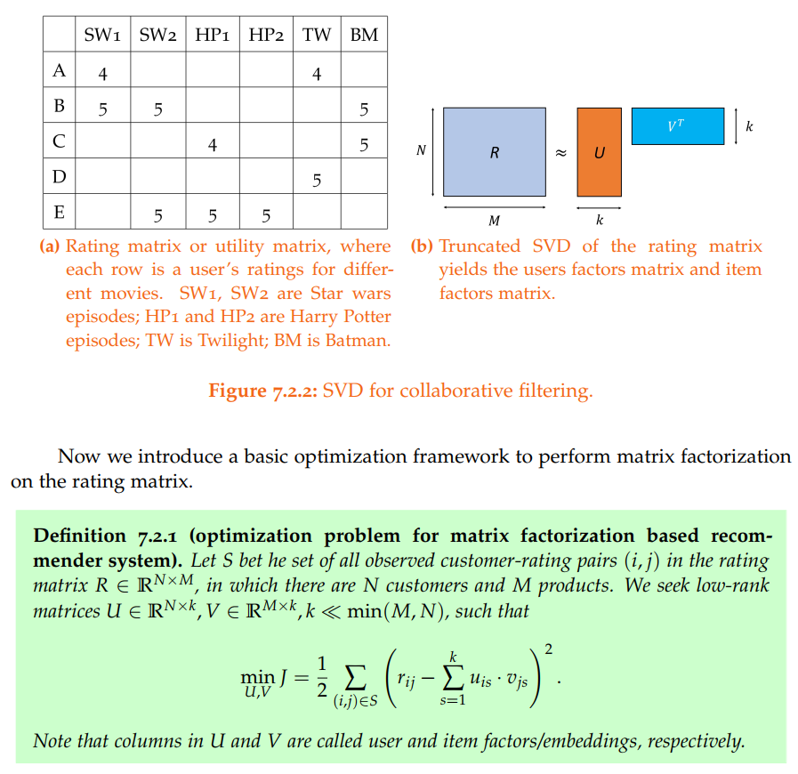

# Essentials of Mathematical Methods
## About
This repo contains my online evolving two-volume book **Essentials of Mathematical Methods**.\
**Vol-1 Foundations and Principles** surveys foundations and principles in applied math and statistical modeling methods, including linear algebra, matrix analysis, optimization, statistics, and dynamical systems.  The volume takes an approach that resembles many math and CS theory textbooks. Each section starts with basic concepts, motivations and definitions, then important properties in Lemma, Theorem, and Corollary (with proof), and then computational procedures summarized in Methods and Algorithms. I believe this approach can help distinguish different concepts and state important results in a clean and organized manner. \
**Vol-2 Statistical learning and Deep learning** surveys Foundations, algorithms, and recent developments in statistical learning, deep learning, and reinforcement learning. Their applications in natural language processing, speech and speaker recognition, etc. are demonstrated.

I am hoping this book can be beneficial to you, either you are preparing for interviews or you are doing machine learning applications and research.

This book is **free**.
If you have any questions or suggestions, you can create a pull request or send me an email at yangyutu123@gmail.com

## Downloads 
### Whole book
[All-in-One](https://github.com/yangyutu/EssentialMath/blob/master/PDFRelease/Mathmain2021.pdf)

## Table of Contents
### *Vol-1 Foundations and Principles*
### I Mathematical Foundations
* Sets, Sequences and Series
* Metric Space
* Advanced Calculus
* Linear Algebra and Matrix Analysis
* Basic Functional Analysis

### II Mathematical Optimization Methods

* Unconstrained Nonlinear Optimization
* Constrained Nonlinear Optimization
* Linear Optimization
* Convex Analysis and Convex Optimization

### III Classical Statistical Methods
* Probability Theory
* Statistical Distributions
* Statistical Estimation Theory
* Multivariate Statistical Methods
* Linear Regression Analysis
* Monte Carlo Methods

### IV Dynamics Modeling Methods
* Models and estimation in linear systems
* Stochastic Process
* Stochastic Calculus
* Markov Chain and Random Walk
* Time Series Analysis

### *Vol-2 Statistical Learning and Deep Learning*
### V Statistical Learning Methods
* Supervised Learning Principles
* Linear Models for Regression
* Linear Models for Classification
* Generative Models
* K Nearest Neighbors
* Tree Methods
* Ensemble and Boosting Methods
* Unsupervised Statistical Learning
* Practical Statistical Learning

### VI Deep Learning Methods

* Foundations of Deep Learning
* Network Training and Optimization
* Convolutional Neural Network
* Recurrent Neural Network

### VI Optimal Control and Reinforcement Learning Methods
* Classical Optimal Control Theory
* Reinforcement Learning

### VII Applications
* Natural Language Processing I: Foundations
* Natural Language Processing II: Tasks
* Deep Learning for Automatic Speech Recognition
* Deep Learning for Speaker Recognition

### Appendix: Supplemental Mathematical Facts

## License statement

You are free to redistribute the material in any medium or format under the following terms:

    -Attribution: You must give appropriate credit, provide a link to the license, and indicate if changes were made. You may do so in any reasonable manner, but not in any way that suggests the licensor endorses you or your use.
    -NonCommercial: You may not use the material for commercial purposes.

*The licensor cannot revoke these freedoms as long as you follow the license terms. This licence is created via creative commons (https://creativecommons.org). If you have any questions regarding the license, please contact the author.
## Demonstration
### Linear algebra
SVD (Singular Value Decomposition) is one of the most important results in linear algebra. It is the cornerstone of many important methods in applied math, statistics, and machine learning. This books summarizes the properties of SVD with the following theorem and diagram. The proof is concise with all the supporting theorems and lemma included in the book.

 

The following diagram shows the shape of resulting matrices and captures the relationship between complete SVD and compact SVD. 

 

A common mistake on the relationship between U and V is discussed as wells.

 

### Applied functional analysis

Contraction mapping and its closely related fixed point theorem are essential results in applied functional analysis. We start with a diagram to  help understand contraction mapping. 

 

We then state its definition and a simple example. 

 

We also discuss how to identify a contraction mapping in practice.

 

Finally, with the understanding of contraction mapping, we introduce the fixed point theorem. 

 

We give a detailed and concise proof.

 

### Statistics

In multivariate Gaussian statistics, the affine transformation theorem is used to prove a number of important properties of Gaussian random variables (such as addition, condition, etc.). This book first gives a proof of this theorem based on moment generating functions.

 

Then the book gives the application of this theorem to the sum of multivariate Gaussian random variables. It is worth mentioning that the author emphasizes in the footnote that these result only hold when the joint normality conditions holds. 

 

### Machine learning

#### Fisher linear discriminant analysis

We start with Fisher linear discriminant analysis by contrasting with PCA.

 

We use diagrams to build the intuition of deriving Fisher linear discriminant.

 

The intuition of deriving Fisher linear discriminant can be summarized by following definition.

 

We summarize the solution to the optimization problem in the following Lemma.

 

#### Unified linear models

SVM, logistic regression and Perceptron learning are commonly used linear classification model in machine learning.  The three models can be unified under the same mathematical optimization framework, with each method corresponds to a different loss function. This book elaborates and shows how to transform these three models into this unified framework.

 

Different loss functions for classfication are compared and summarized in the following figure. 

 

### 

#### SVD for collaborative filtering

One important application of SVD in machine learning area is collaborative filtering for recommenders. 

 

### Reinforcement learning

Value iteration is one of the cornerstone theorems in reinforcement learning. However, many textbooks and online resources simply skip the proof. This book puts together a concise proof through contraction mapping and fixed point theorem. The contraction mapping and fixed point theorem, which are important tools in applied math, are introduced in detail in Part I of this book.

 

Then the book gives an algorithm based on the value iteration theorem.

 

