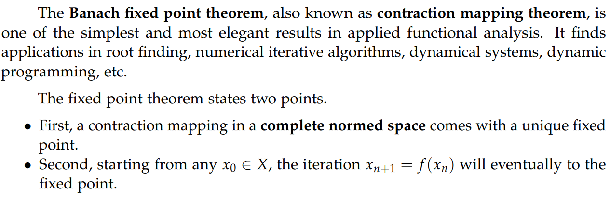

 

# 数学方法精要笔记

# **——深入数学建模，** **机器学习和深度学习的数学基础**

 

# 

## **书籍介绍**

在信息爆炸的当今，大到企业巨头的经营方向， 小到和日常生活相关的人工驾驶等领域，数学建模和人工智能都对信息数据的收集、处理、解释以及做出决策将起到至关重要的作用。负责开发模型和算法的一线科学家和工程师， 都需要有坚实的数学基础。 相信有许多所有对数学建模，机器学习和深度学习深感兴趣的小伙伴，有一定的基础却常常被繁杂的定理和错综的模型所困—— 那么这本书就是一部可供随时查阅，帮助大家融会贯通的宝典。

本书有以下几大亮点：

1. 理论与实践相结合，学以致用。内容详尽，涵盖范围广。

a.  全书干货多覆盖范围广， 包含~100个核心算法， 约300个示意图。例子丰富，且绝大部分定理都有证明。 

b.  本书凝聚了作者多年数学建模和机器学习研究和实战经验。根据应用领域， 本书总结并深入讲述传统方法到前沿的深度学习和强化学习算法，帮助读者迅速抓住重点，减少弯路。

2. 便于学习查找，由浅入深，步步为营，多用示意图以助读者理解

a.  本书的算法和定理证明中常常引用相关的其他章节, 循序渐进，有助于读者建立树状知识脉络，一网打尽相关知识点。

b.  本书例子详实并多伴有示意图，清晰易懂。作者基于多年实践，总结并对易混淆的概念进行比对，帮助读者更加扎实掌握相关内容。

全书GitHub 地址： https://github.com/yangyutu/EssentialMath

全书总共33章分成六个部分：

1. **Mathematical Foundations** **（数学基础）**
2. **Mathematical Optimization Methods** **（数学优化方法）**
3. **Classical Statistical Methods** **（经典统计方法）**
4. **Dynamics Modeling Methods** **（动力系统建模方法）**
5. **Statistical Learning Methods** **（统计学习方法）**
6. **Optimal Control and Reinforcement Learning Methods** **（最优控制和强化学习方法）**

**作者对一些热门章节进行章节归类打包下载**

1. **Linear Algebra and Matrix Analysis**
2. **Mathematical Optimization**
3. **Probability and Statistical Estimation**
4. **Stochastic Process**
5. **Markov Chain and Random Walk**
6. **Linear Regression Analysis**
7. **Statistical Learning**
8. **Neural Network and Deep Learning**
9. **(Deep) Reinforcement Learning**

整体目录如下：

**I Mathematical Foundations**

- Sets, Sequences and Series
- Metric Space
- Advanced Calculus
- Linear Algebra and Matrix Analysis
- Function Sequences, Series and Approximation
- Basic Functional Analysis

**II Mathematical Optimization Methods**

- Unconstrained Nonlinear Optimization
- Constrained Nonlinear Optimization
- Linear Optimization
- Convex Analysis and Convex Optimization
- Basic Game Theory

**III Classical Statistical Methods**

- Probability Theory
- Statistical Distributions
- Statistical Estimation Theory
- Multivariate Statistical Methods
- Linear Regression Analysis
- Monte Carlo Methods

**IV Dynamics Modeling Methods**

- Models and estimation in linear systems
- Stochastic Process
- Stochastic Calculus
- Markov Chain and Random Walk
- Time Series Analysis

**V Statistical Learning Methods**

- Supervised  Learning Principles and Methods
- Linear Models for Regression
- Linear Models for Classification
- Generative Models
- K Nearest Neighbors
- Tree Methods
- Ensemble and Boosting Methods
- Unsupervised  Statistical Learning
- Neural Network and Deep Learning

**VI Optimal Control and Reinforcement Learning Methods**

- Classical Optimal Control Theory
- Reinforcement Learning

**Appendix: Supplemental Mathematical Facts**

## **内容展示**

### **线性代数篇**

SVD (矩阵奇异值分解) 是线性代数中最重要工具之一， 经常在各类统计以及重要机器学习方法中出现。作者用如下图示和定理对SVD的性质进行总结和证明。该证明简洁扼要，且所用到的其它辅助定理与证明都在本书中 。作者使用一个图示来分别指出complete form SVD 和 compact form SVD 的结果和原矩阵的关系。 

 

 

作者同时指出新手常混淆的一个知识点：

 

### **应用泛函篇**

压缩映射和与其密切联系的不动点定理是应用泛函中十分重要的理论结果。 我们首先通用一个示意图来展示什么是压缩映射。

 

随后，我们对压缩映射进行定义并给出实例。

 

同时，我们也讨论了实践中如果确定一个映射是压缩映射。

 

在理解了压缩映射的基础上，我们讨论了不动点定理。

 

最后， 我们给出简要证明。

 

### **统计篇**

多元高斯随机变量( multivariate random variable) 的affine transformation 经常被用于证明高斯随机变量的一系列重要性质（比如加和， 条件等）。本书首先给出用矩函数对此定理的证明。

 

然后本书给出此定理在多元高斯随机变量加和中的应用。值得一提的是， 作者用脚注强调jointly normal这一重要条件。

 

 

### **机器学习篇**

在机器学习的线性分类模型中，三种常见模型 SVM, logistic regression 和 Perceptron learning 可以统一在同一个数学优化框架下，每种方法对应不同的loss function。作者对如何把这三种模型转化成同一个框架进行了详细的阐述和证明。

 

 
下面比较并归纳了不同的分类损失函数。 

 

### **强化学习篇**

Value iteration值迭代是强化学习的基石型定理之一，然而目前很多教材资料中并没有给出证明。 本书通过contraction mapping 和 fixed point theorem 得出简明的证明。contraction mapping 和 fixed point theorem 的知识点则在在本书Part I 有详细介绍。 

 

之后作者给出基于value iteration的算法。

 

## **作者心得体会**

这本书来源于我在美国攻读博士期间上的上课笔记。 当时为了解决科研中 一些难题， 上了大量计算机和数学课。笔记由一开始的零零散散，到后来渐成规模。我真正开始系统性地整理成书是受到如下一句话的启发：

**If you want to learn something, read about it. If you want to understand something, write about it. If you want to master something, teach it.**

我逐渐搭建本书的框架，将学习笔记的内容在框架下进行整合，把最核心的知识点提炼出来。随着我的科研领域从最初的计算物理建模到现在的微型机器人系统的多智体强化学习，本书的内容也从传统应用数学和统计扩展到前沿的深度学习和人工智能方法 。在写书的过程中，我能感受到自己的知识体系越发完备，且系统性的学习和研究对于理论难点的掌握，以及跨领域的应用都有着至关重要的作用。

我希望将自己的书和心得体会分享给大家。无论是能够为志同道合的小伙伴们解答一些疑惑，还是帮助希望入门的朋友”打通任督二脉“，或者是给同在科研战线上奋斗的同志一些灵感，我都会非常开心。

 

 
